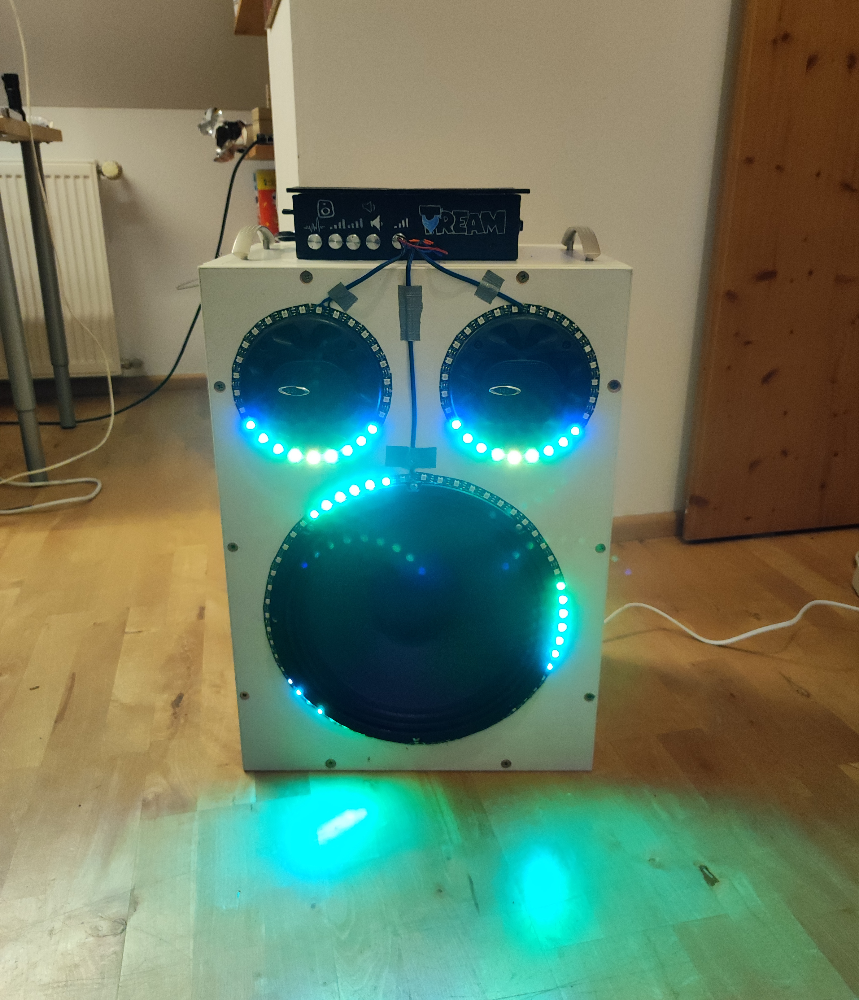

# AudioVisualiser

### Program to control multiple LED-Strips with an Arduino nano (every) using a microphone as input

**micInput:** Reads microphone and outputs the smoothed current and average Volume level

**strip:** Resembles one LED strip and has different Modes that change the LEDs according to micInputs outputs

Automatically switches into an off Mode if average Volume drops under specific Threshold 

Limits updates/s to ~80 for consistency

TODO: add control via Remote

---

|   |   |
| ------------- | ------------- |

#### More Videos + Sound in Videos folder 

|   |   |
| ------------- | ------------- |