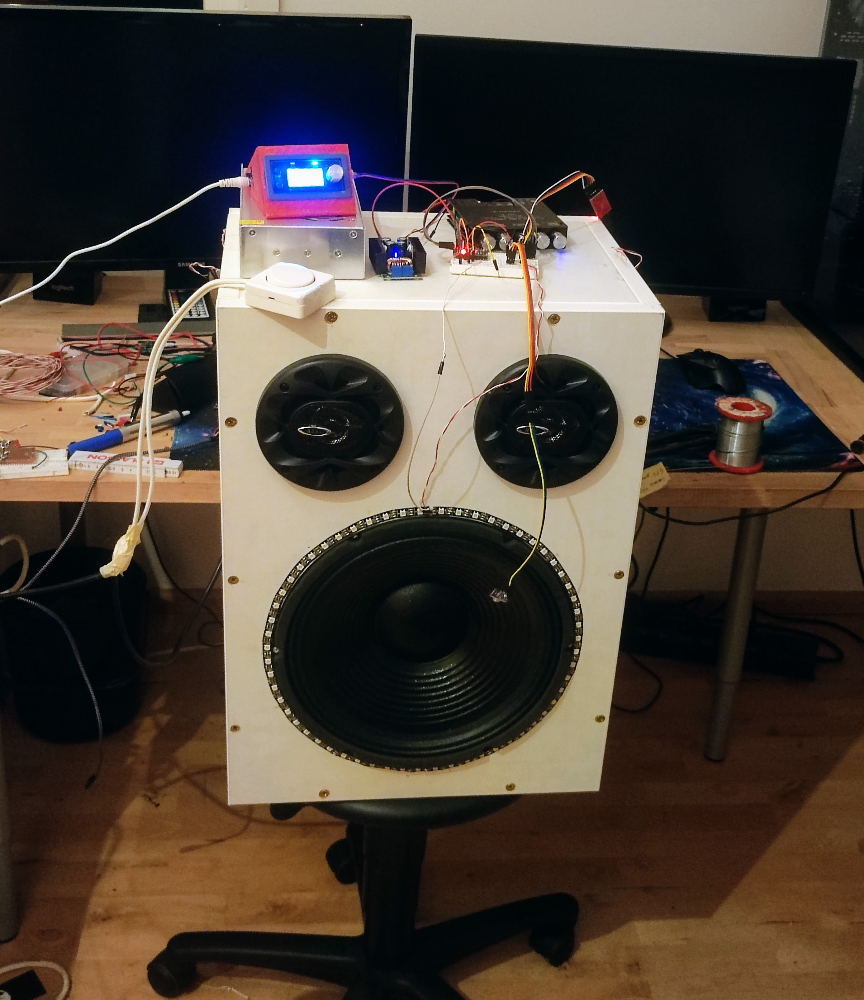

# AudioVisualiser
### program to control multiple LED-Strips with an arduino-nano using sound from an microphone attached to speakers

### currently controlls 3 LED strips (2 parallel), 6 more (3 parallel) on the side to be added

#### More Videos + Sound in Videos folder 

